 

##### *Made with love and [Doc](https://gitlab.com/iljushka/doc)*
In dieser kleinen Bedienungsanleitung will ich dir zeigen, wie unser kleines Produkt funktioniert, was beachtet werden muss und alles weitere. 

# Wo isch des Produkt nu?
Kurz und knapp: [Hier](https://www.mublog.xyz).

# Einrichtung (Front-End)
Zur Erstellung der Anwendung müssen wenige Schritte gemacht werden:
* Das Paket `npm` installieren [[Link]](https://www.npmjs.com/get-npm)
* zum `./public`-Ordner wechseln
* `npm install` in der Konsole ausführen
* Und zum Schluss in der Konsole `npm run build` ausführen

Wenn alle Schritte ausgeführt sind, müsste die Datei `./public/app.js` erstellt worden sein, diese sollte so aussehen:

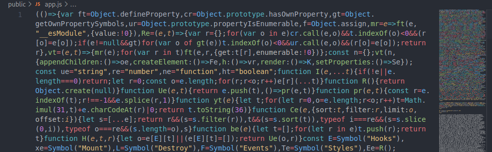

Wenn du darin nichts erkennen kannst, hast du alles richtig gemacht :)

Diese Datei enthält alle wichtigen Scripts und Sprachinformationen, die die Anwendung benötigt um zu laufen. Alle weiteren Dateien befinden sich bereits im Ordner, so auch die `index.html`.

Diese Anwendung kann auf einem beliebigen Hoster hochgeladen werden, dies soll aber kein Teil der Anleitung sein, weil jeder Hoster anders funktionieren könnte.

# Bedienungsanleitung
Wenn du die Seite zum ersten Mal besuchst, könnte sie so aussehen:
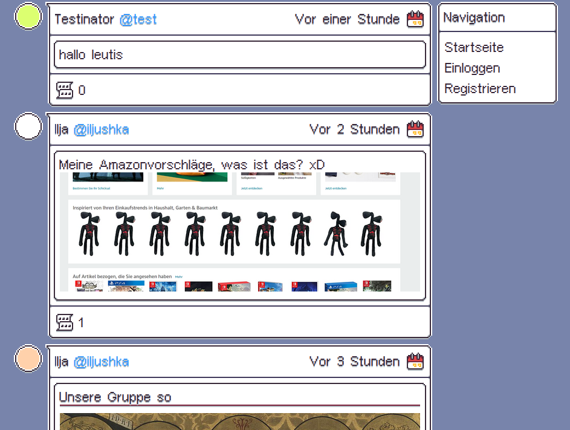

Auf der linken Seite befinden sich die Posts der Nutzer, auf der rechten Seite ist die Hauptnavigation, das Layout ist somit ziemlich übersichtlich für das Erste.

## Registrierung
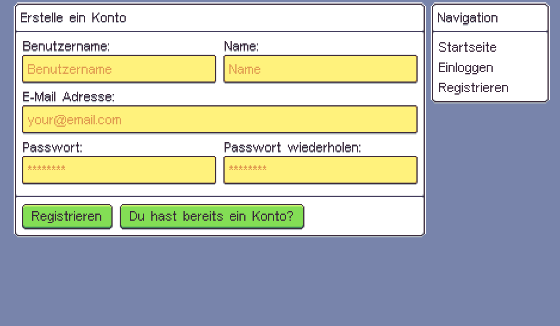

Du kannst ein Konto erstellen und dafür werden Informationen für folgende Zwecke benötigt:

#### Benutzername
Über diesen Namen können andere Nutzer dein Profil erreichen, dieser wird auch bei Posts angezeigt. Dieser Name ist einzigartig und lässt sich nicht mehr ändern. Denke dir also einen coolen Namen aus und verwende bitte keine beleidigenden Inhalte.

#### Name
Diese Information ist nicht einzigartig (in den meisten Fällen) und kann ebenfalls von den anderen Nutzern eingesehen werden.

#### E-Mail Adresse
Zurzeit wird diese Information nicht intern verarbeitet bzw. erhältst du keine E-Mails. Du kannst also auch eine Test-E-Mail verwenden, wie z. B. `dein_nutzername@localhost`.

#### Passwort
Natürlich musst du auch in dein Konto einloggen können. Dein Passwort musst du zwei mal angeben, damit du weißt, dass du dich nicht aus Versehen vertippt hast. Keine Sorge, wenn du dich vertippt haben solltest, wirst du benachrichtigt.

Konto erstellt? Super, dann wurdest du bereits weitergeleitet und so komme ich zum nächsten Punkt.

## Einloggen
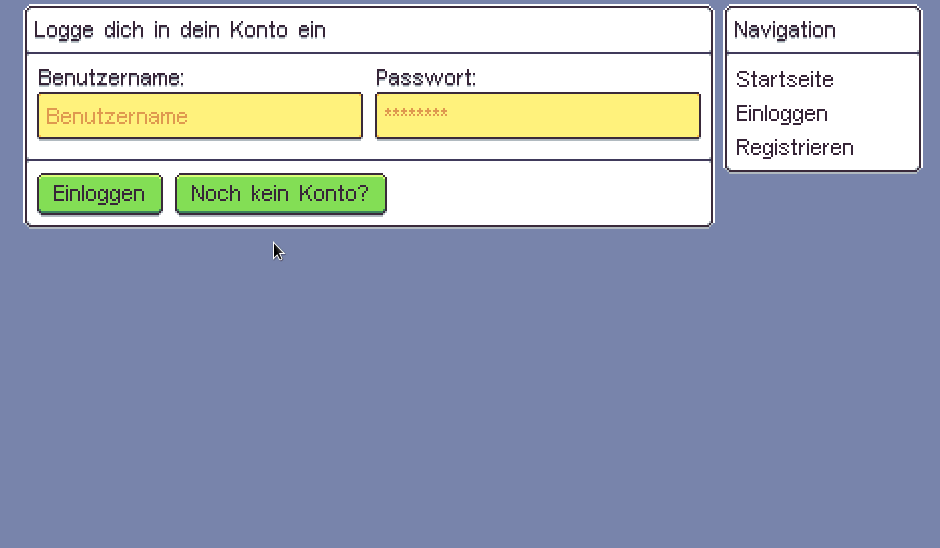

Viel falsch kannst du hier nichts machen. Du gibst deine Informationen ein, die du bei der Registrierung hinterlassen hast und du solltest auf die Startseite weitergeleitet werden. 
Bei einer falschen Eingabe wirst du auch hier benachrichtigt, die Informationen halten sich aber in Grenzen um Angreifern weniger Informationen zu bieten.

## Ausloggen
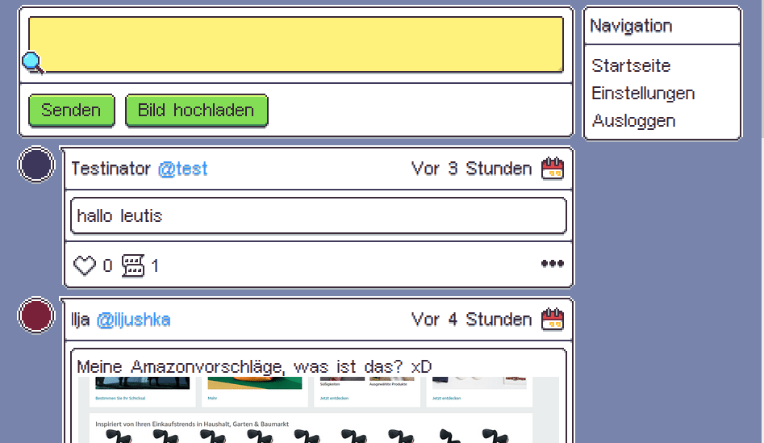

Wozu loggst du dich ein, wenn du jetzt schon wieder raus willst? Verzeih' ich dir aber, klick dafür in der Navigation einfach auf `Ausloggen`.

## Post verfassen
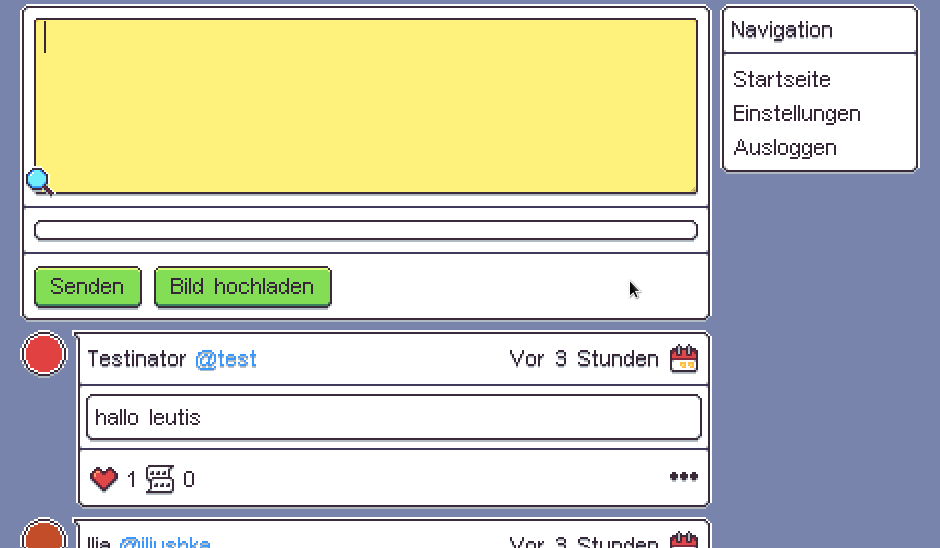

Auf µblog dreht sich alles um Posts, so kannst auch du Inhalte rein setzen.
Zum Schreiben von Posts kannst du die Markdown-Syntax verwenden.

# Bilder hochladen
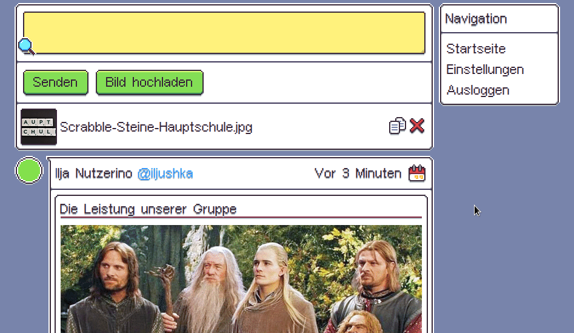

Um ein Bild zum Post hinzuzufügen musst du nur auf den Knopf mit der Aufschrift "Bild hochladen" klicken. Daraufhin erscheint im unteren Bereich eine Übersicht über deine Bilder. Daneben sind 2 Schaltflächen. Das **X** löscht das Bild wieder und mit einem Klick dem Kopiersymbol speicherst du den Link (mit der MarkDown-Syntax) in den Zwischenspeicher. Diesen Text musst du dann nur noch in die Schreibbereich einfügen.

## Post löschen
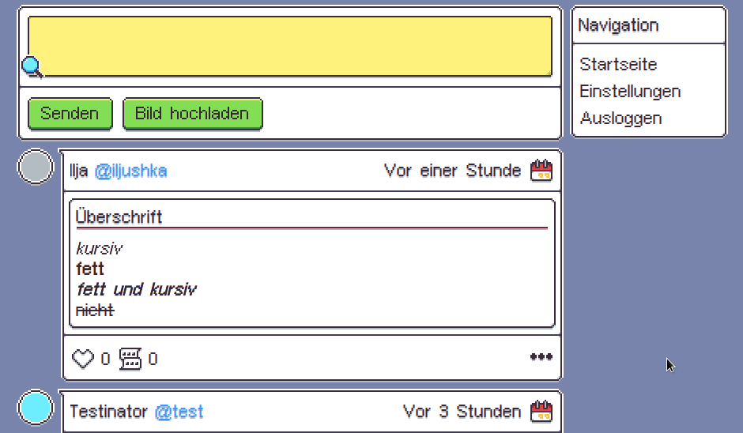

Dir gefällt dein Post nicht mehr oder hast aus Versehen jemanden beleidigt? Entschuldigen wäre zwar die bessere Option, aber du kannst den Post auch ganz einfach über das Menüsymbol unten rechts entfernen.

## Post ent/liken
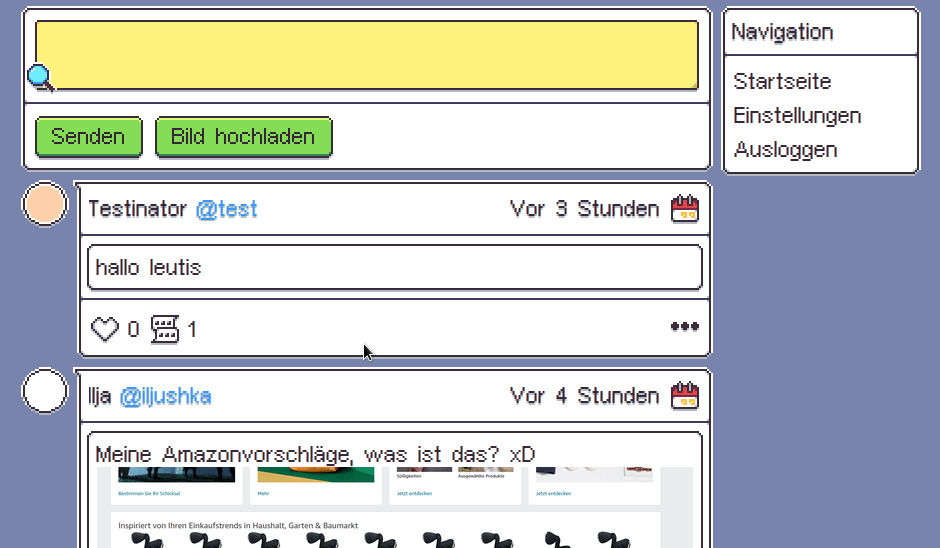

Du hast einen neuen Lieblingspost? Zeig es der Welt indem du das Herzsymbol anklickst. Ob du einen Post geliked hast, siehst du, wenn es rot ist.

## Kommentare lesen und verfassen
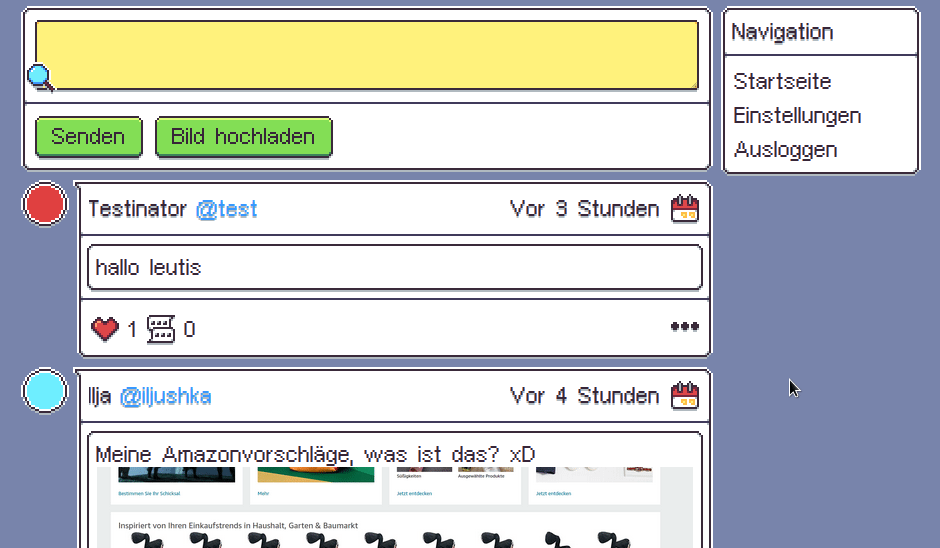

Dir gefällt ein Post so gut, dass du am liebsten kommentieren könntest? Warum tust du es einfach nicht?
Klicke dazu einfach auf das Kommentarsymbol neben dem Herzen. Nun befindest du dich in der Kommentarsektion und kannst dich mit anderen Nutzen über den Post unterhalten. Aber Achtung! Den Kommentar selber kannst du nicht bearbeiten, also passe auf deine Wortwahl auf.

## Profil besuchen
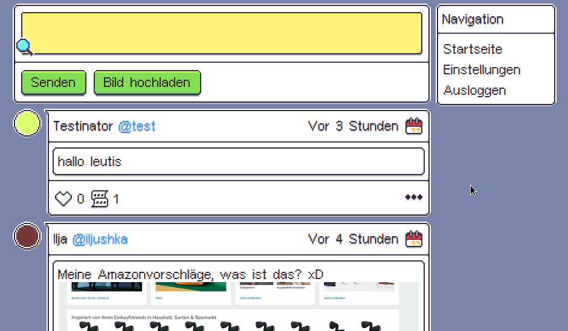

Du willst nur die Posts eines bestimmten Nutzers sehen? Kein Problem, lasse dir die User-Card anzeigen, indem du mit dem Mauszeiger über ein Nutzerbild gehst. Über einen Klick auf dem Namen wechselst du dann zu dem jeweiligen Profil.

## Nutzer ent/folgen
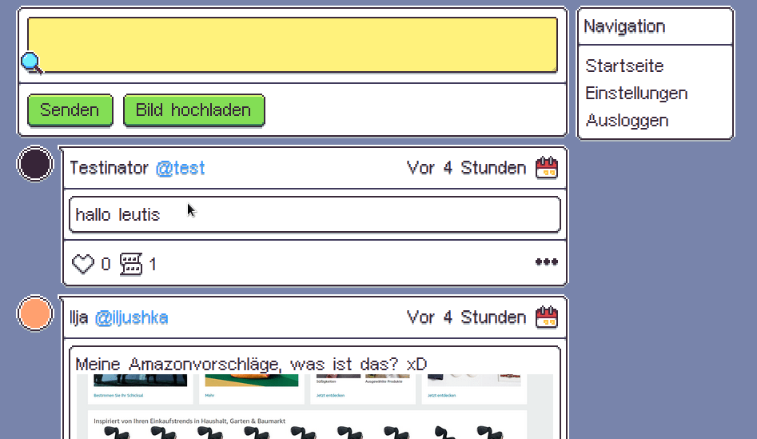

Ein Nutzer gefällt dir besonders gut und du magst die Posts? Zöger nicht lange und *stalke* sie einfach!
Rufe dazu wieder die User-Card auf und drücke auf den Knopf mit dem Plus zum folgen. (Zum Entfolgen ist da ein Minus)

## Einstellungen
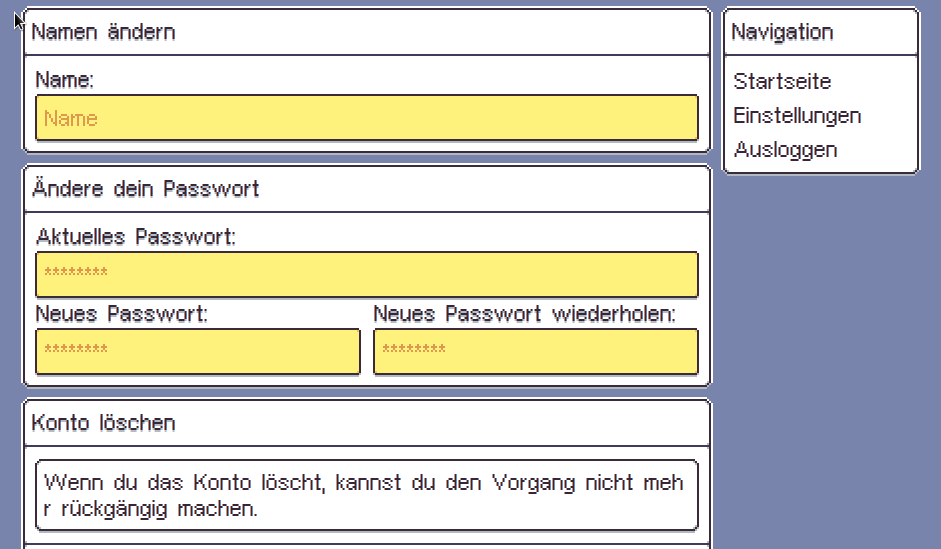

Zurzeit gibt es nicht viele Einstellungen, die du vornehmen kannst, aber hier hast du einen kleinen Überblick.

### Namen ändern
Dir gefällt dein alter Name nicht mehr? Benenne dich einfach um. Sobald du anfängst zu tippen, erscheint dir auch ein Knopf, welcher die Änderungen speichert.

### Passwort ändern
Um dein Passwort zu ändern, musst du erst dein altes Passwort eingeben - daraufhin gibst du zwei mal dein neues Passwort ein und schon hat sich die Sache.

### Konto löschen (Experimentell)
Warum du auch immer dein Konto löschen willst. Unbegreiflich, aber ich werde dich nicht daran hindern.

### Progressive Webandwendung
Mit einem Klick kannst du alle wichtigen Daten, die die Anwendung benötigt, lokal abspeichern.
Dies kann am Rechner nützlich sein, wenn du nur langsames Internet hast und nicht ständig alle Bilder neu laden willst.
Auch werden alle notwendigen Scripts lokal hinterlegt, damit das Laden auch offline funktioniert.